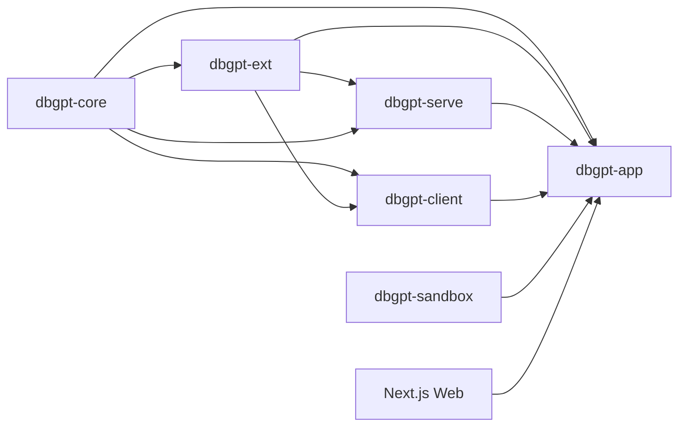
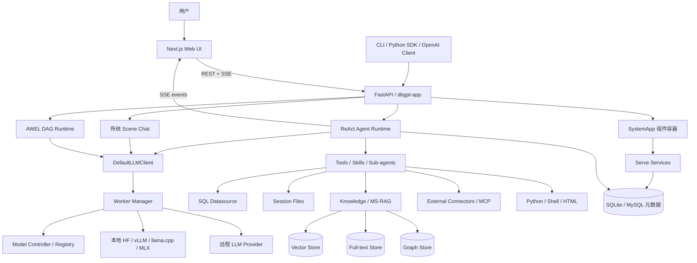
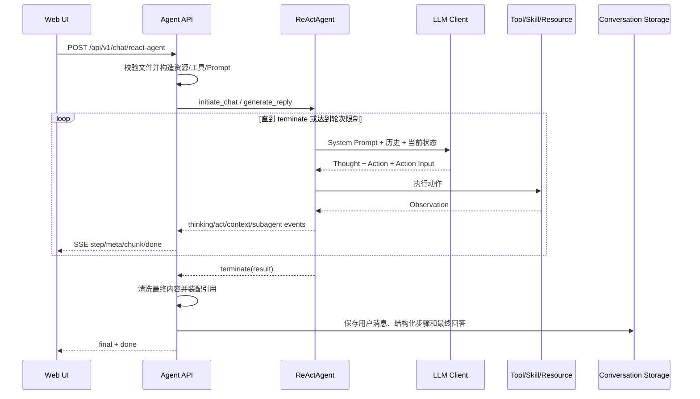

# DB-GPT 技术栈、架构、逻辑与核心功能梳理

## 0. 文档与代码基线

| 项目 | 值 |
|---|---|
| 分析日期 | 2026-08-21 |
| 上游仓库 | `https://github.com/eosphoros-ai/DB-GPT.git` |
| 上游分支 | `main` |
| 分析基线提交 | `651fc13e` (`feat: support multi-file upload and analysis`) |
| Git 描述 | `v0.8.1-64-g651fc13e` |
| Python 包版本 | `0.8.1` |
| 本地分析分支 | `project-architecture-20260821` |
| 文档版本 | `1.0.0` |

本文以当前源码为准，不只复述 README。项目内已有的
`DB-GPT-Core-Code-Design-Analysis.md` 偏重包设计，本文进一步覆盖当前
Agentic Data 主链路、传统场景式 Chat、前后端交互、数据与模型链路、部署方式、
核心功能分级和工程风险。

## 1. 一句话定位

DB-GPT 是一个以 **ReAct Agent 为当前交互核心**、以 **数据源 / 文件 / 知识库 / Skills /
外部 Connector 为可调用资源**、同时提供 **AWEL 确定性工作流、模型服务、RAG、应用构建和
Web UI** 的开源 AI 原生数据分析平台。

它不是单一的 Text2SQL 工具，也不是单一的知识库问答系统。更准确的理解是：

> 一个面向数据任务的 Agent 运行时 + 多模型网关 + 多源数据/RAG 平台 + 可视化应用工作台。

## 2. 哪些功能是核心功能

### 2.1 产品核心（用户直接感知，P0）

1. **Agentic 数据分析**
   - 用户给出目标，ReAct Agent 自主拆解任务、选择工具、执行、观察结果并继续迭代。
   - 支持任务计划、流式步骤、上下文压缩、人工追问、并行子 Agent、产物与引用。
2. **多源数据访问与分析**
   - 结构化数据库：读取 Schema、生成并执行 SQL、返回表格。
   - 文件：CSV、Excel 等单文件和多文件上传、检查、加载、汇总与分析。
   - 非结构化知识：文档知识库、语义检索、关键词检索、文件浏览、代码图谱查询。
   - 外部 Connector：按用户选择加载 MCP/外部系统工具。
3. **SQL + Python/Shell 执行**
   - SQL 用于数据库查询；Python 用于统计、清洗、计算和绘图；Shell 用于脚本与 CLI 工作流。
4. **Skills 驱动的领域能力**
   - Skill 由 `SKILL.md`、脚本、模板和参考资料组成，可匹配、加载、执行、上传和导入。
   - 内置 CSV/Excel 分析、财报分析、Walmart 销售分析、Skill Creator、浏览器 Skill。
5. **可视化结果与报告**
   - SSE 实时显示思考步骤、工具输出、代码、表格、图表、图片、HTML 报告和最终答案。
   - 会话历史保存结构化步骤，支持回放、分享链接和带来源引用的回答。

### 2.2 平台核心（支撑产品能力，P0/P1）

1. **Agent Framework**：Agent 生命周期、消息、角色、资源、动作、记忆、ReAct 解析与执行。
2. **Model Runtime / SMMF**：本地模型、代理模型、Controller、Worker、注册、路由和流式推理。
3. **MS-RAG**：多源文档摄取、切分、Embedding、向量/全文/图索引、检索与重排。
4. **AWEL**：以 DAG + Operator 构建确定性、可复用、可视化的 LLM 工作流。
5. **SystemApp 组件容器**：统一组件注册、依赖获取和应用生命周期。
6. **Serve 服务体系**：围绕 Conversation、Datasource、RAG、Flow、Model、File 等领域提供 API。

### 2.3 次核心与兼容功能（P1/P2）

- 传统场景式 Chat：普通对话、数据库问答、知识问答、Excel 分析、Dashboard。
- GPTs/Agent 应用管理、Prompt 管理、模型评测、反馈、定时任务、分享。
- Python 客户端 SDK、CLI、应用仓库和包发布工具。
- 训练、模型加速、Flash Attention、量化和多种本地推理后端。

### 2.4 核心判断

当前战略主线是 `Agentic Data + ReAct + Skills/Tools`。`AWEL` 是并列的确定性编排底座；
传统 `scene/*` Chat 仍然完整可用，但更多承担兼容和特定场景模板职责，不应再被理解为唯一主架构。

## 3. 技术栈

### 3.1 后端与基础工程

| 类别 | 技术 | 用途 |
|---|---|---|
| 语言 | Python `>=3.10`，推荐 3.11 | 后端、Agent、RAG、模型服务、CLI |
| Web/API | FastAPI、Uvicorn、Pydantic v2 | REST API、SSE、Schema 和服务运行 |
| CLI | Click、Rich、PrettyTable | `dbgpt` 命令、配置向导、服务管理 |
| 异步 | `asyncio`、aiohttp、httpx | 流式模型调用、SSE、工具并发 |
| ORM/迁移 | SQLAlchemy 2、Alembic | 元数据、会话、知识库、Flow、模型配置持久化 |
| 配置 | TOML、dataclass、环境变量插值 | 模型、服务、存储、RAG 和部署配置 |
| 包管理 | uv workspace、Hatchling、`uv.lock` | Python monorepo、构建、锁定依赖 |
| 质量 | pytest、pytest-asyncio、Ruff、mypy、pre-commit | 测试、格式化和类型检查 |
| 可观测性 | 自研 tracer + 可选 OpenTelemetry | Span、运行日志、OTLP |
| 部署 | Docker、Docker Compose | Web 服务与 MySQL 一体化运行 |

仓库约有 1357 个 Python 文件、183 个 Python 测试文件，属于较大型 Python monorepo。

### 3.2 前端

| 类别 | 技术 | 用途 |
|---|---|---|
| 框架 | Next.js 13.4、React 18、TypeScript 5.1 | Web UI 与静态导出 |
| UI | Ant Design 5、MUI、Tailwind CSS、Emotion | 组件、布局和样式 |
| 可视化 | AntV G2/G6/S2/AVA/GPT-Vis、Graphin、Cytoscape、React Flow | 图表、知识图谱、表格和 Flow 编辑器 |
| 网络 | Axios、Fetch、`@microsoft/fetch-event-source` | REST 与 SSE |
| 编辑器 | Monaco Editor | SQL、代码与 Prompt 编辑 |
| 内容 | Markdown-it、KaTeX、rehype/remark、jsPDF/html2canvas | Markdown、公式、导出和报告 |
| 国际化 | i18next、react-i18next | 多语言界面 |

`web/pages/index.tsx` 是当前 Agentic 工作台的大型聚合页面；
`web/hooks/use-react-agent-chat.ts` 负责 ReAct SSE 会话状态；Flow、知识库、数据源、模型、
Skills、Connector 和评测分别有独立页面/API client。

### 3.3 模型与 AI 生态

- 本地推理：Hugging Face Transformers、vLLM、llama.cpp、MLX、FastChat 适配层。
- 代理模型：OpenAI/OpenAI-compatible、SiliconFlow、Tongyi、Zhipu、Anthropic、LiteLLM、
  Ollama、DeepSeek、Gemini、Moonshot、Minimax、Volcengine 等。
- Embedding/Reranker：本地 Transformers/Sentence Transformers 或远程代理服务。
- 加速：PyTorch CPU/CUDA 11.8/12.1/12.4、Flash Attention、bitsandbytes、GPTQ、vLLM。

### 3.4 数据、RAG 与存储

- 数据库连接：MySQL、PostgreSQL、SQLite、DuckDB、Oracle、SQL Server、ClickHouse、
  Doris、StarRocks、OceanBase、openGauss/GaussDB、Hive、Vertica、MaxCompute 等。
- 向量存储：Chroma、Milvus、Weaviate、Qdrant、Elasticsearch、OceanBase Vector、
  pgvector、Valkey。
- 图存储：TuGraph、Neo4j、内存图。
- 全文检索：Elasticsearch、OpenSearch。
- 对象/文件存储：本地文件、S3、OSS。
- 文档解析：PDF、Word、PowerPoint、Markdown、HTML、Excel 等扩展依赖。

## 4. Monorepo 包结构与依赖方向

```text
DB-GPT/
├── packages/
│   ├── dbgpt-core/         核心抽象与运行时（发布包名 dbgpt）
│   ├── dbgpt-ext/          数据源、存储、RAG、模型等具体适配
│   ├── dbgpt-serve/        领域服务、DAO、API 与 Serve 组件
│   ├── dbgpt-app/          产品应用、启动装配、业务 API、场景 Chat
│   ├── dbgpt-client/       Python SDK
│   ├── dbgpt-sandbox/      代码执行运行时
│   └── dbgpt-accelerator/  PyTorch/推理加速依赖选择
├── web/                    Next.js 前端
├── skills/                 内置 Skills
├── configs/                TOML 配置样例
├── pilot/                  默认工作区、元数据、示例数据
├── docs/                   Docusaurus 文档
├── docker/                 镜像与部署材料
└── tests/                  跨包测试
```

主要依赖方向：



说明：图表示逻辑层次，不是严格无环的 Python import 图。`dbgpt-app` 是最终装配层，依赖所有主要包；
`dbgpt-core` 尽量只保留抽象和通用实现；`dbgpt-ext` 提供可替换适配；`dbgpt-serve` 把领域能力服务化。

## 5. 总体运行架构



架构有四种重要“编排方式”：

1. **ReAct Agent**：适合目标开放、步骤未知、需要自主选工具的数据分析。
2. **AWEL DAG**：适合流程确定、可重复、需要可视化编排和稳定生产执行的任务。
3. **传统 Scene Chat**：适合固定场景 Prompt + Output Parser + 后处理。
4. **Serve Service**：适合标准 CRUD、资源管理和领域 API，不需要 LLM 自主决策。

## 6. 应用启动与组件装配逻辑

主命令是 `dbgpt`，入口为 `dbgpt.cli.cli_scripts:main`。

### 6.1 启动链

```text
dbgpt start web [--config/--profile]
  -> dbgpt_app._cli.start_webserver
  -> 配置向导/配置文件解析
  -> dbgpt_app.dbgpt_server.run_webserver
  -> load_config + scan_configs
  -> initialize_app
  -> server_init：初始化元数据库与全局 Config
  -> mount_routers：挂载业务 API
  -> initialize_components：装配全局组件
  -> SystemApp.on_init
  -> SQLAlchemy 建表/Alembic 迁移
  -> SystemApp.after_init
  -> 初始化本地或远程 WorkerManager
  -> 挂载 Next.js 静态资源
  -> SystemApp.before_start
  -> Uvicorn 启动
```

### 6.2 SystemApp

`SystemApp` 是轻量级 IoC/组件容器和生命周期总线：

- `register` / `register_instance`：注册组件或实例。
- `get_component`：按类型或名称取得依赖。
- 生命周期：`on_init -> after_init -> before_start -> after_start -> before_stop`，同时支持异步钩子。
- FastAPI startup/shutdown 事件被接入组件生命周期。

它装配的关键组件包括：线程池、Scheduler、Model Controller、数据源 ConnectorManager、
RAG StorageManager、Embedding/Reranker、AWEL、Agent ResourceManager、SkillManager、
Conversation/Flow/RAG/Model 等 Serve、代码服务、Prompt 模板和外部 ConnectorManager。

### 6.3 Serve 服务体系

`dbgpt-serve` 采用 `Config + Serve + Service + DAO + API schemas/endpoints` 模式。

启动时注册的主要服务：

- Prompt、Conversation、AWEL Flow、RAG/Knowledge、Datasource、Feedback；
- DbGpts Hub/My、File、Evaluate、Libro、Model；
- External Connector、Scheduled Task、Session File。

`BaseServe` 负责把路由和数据库能力挂到 `SystemApp`；`BaseService` 提供领域服务基类；
DAO 负责 SQLAlchemy 持久化。这套结构是新增标准领域模块时应优先复用的模板。

## 7. 当前核心：Agentic Data ReAct 完整链路

关键文件：

- `packages/dbgpt-app/src/dbgpt_app/openapi/api_v1/agentic_data_api.py`
- `packages/dbgpt-core/src/dbgpt/agent/expand/react_agent.py`
- `packages/dbgpt-core/src/dbgpt/agent/core/base_agent.py`
- `packages/dbgpt-app/src/dbgpt_app/openapi/api_v1/tools/`
- `web/hooks/use-react-agent-chat.ts`

### 7.1 请求入口

前端向 `POST /api/v1/chat/react-agent` 发起请求，知识库专用模式调用
`POST /api/v1/chat/knowledge-agent`。请求主体沿用 `ConversationVo`，核心字段包括：

- `conv_uid`、`user_input`、`model_name`、`user_name`；
- `ext_info.file_ids` / 兼容字段 `file_path`；
- `knowledge_space`、`database_name`、`skill_name`；
- `connector_ids` 等用户选择的资源。

服务端先解析并校验附件。新多文件链路使用 owner + session/task scope，建立文件清单、私有存储路径和
临时物化上下文，避免直接把客户端路径当成可信输入。

### 7.2 运行时资源构造

`_react_agent_stream_impl` 按本轮请求动态构造：

1. 从 Skill Registry 递归加载 Skills；若用户指定 Skill 则预选，否则允许 Agent 匹配。
2. 从 ResourceManager 取得已注册业务工具。
3. 若选择知识空间，创建 `KnowledgeSpaceRetrieverResource` 和绑定空间的 KB 工具。
4. 若选择数据库，通过 `ConnectorManager` 取得连接、表名和表结构。
5. 只注入用户显式选择的外部 Connector 工具。
6. 创建本轮 `react_state`，保存文件、会话、生成图片、自动数据、Skill 和产物信息。
7. 根据 `tool_mode=full/knowledge` 裁剪工具集合。

### 7.3 主要工具

| 工具 | 职责 | 关键约束 |
|---|---|---|
| `todowrite` | 创建/更新任务计划 | 计划通过 `plan.update` 流式显示 |
| `select_skill` / `load_skill` | 匹配并读取 Skill | 支持预选 Skill |
| `execute_skill_script_file` | 执行 Skill 脚本 | 结果可产生图片/结构化数据 |
| `load_file` | 读取本轮上传文件摘要/内容 | 支持多文件 ID，限制观察大小 |
| `execute_analysis` | CSV/Excel 快速检查 | 子进程执行固定 runner，路径仅经环境变量传递 |
| `sql_query` | 查询选择的数据源 | 当前实现做字符串级只读限制，最多展示 50 行 |
| `code_interpreter` | 执行 Python 分析代码 | 每次独立子进程，60 秒超时，收集生成图片 |
| `shell_interpreter` | 执行 Shell/Skill CLI | 当前 Agent 路径直接使用 `LocalRuntime` |
| `html_interpreter` | 生成交互式 HTML 报告 | 支持内联 HTML、Skill 模板和文件模式 |
| `kb_ls/glob/grep/cat` | 浏览知识库文件 | 精确检索优先 grep |
| `semantic_search` | 向量语义检索 | 绑定指定知识空间 |
| `kb_codegraph_*` | 代码实体/调用链/继承图查询 | 仅在空间存在代码图谱时开放 |
| `knowledge_retrieve` | 通用知识资源检索 | 输出可进入引用装配器 |
| `read_file` | 分页读取被持久化的大工具结果 | 仅允许指定结果/快照目录 |
| `question` | 请求用户补充信息 | 有 reply/reject API |
| `dispatch_parallel_tasks` | 并行子 Agent | 默认最多 3 个，可配置 |
| `terminate` | 结束 ReAct 循环并给出结果 | 触发最终答案装配 |

### 7.4 ReAct 循环



`ConversableAgent.generate_reply` 的一般阶段是：初始化回复消息、加载记忆/资源、Thinking、Review、
Act、Verify，然后决定是否重试下一轮。`ReActAgent` 覆盖动作准备和资源加载，使用
`ReActOutputParser` 将模型文本转换为可执行动作。

### 7.5 流式事件协议

后端不是只返回 token，而是返回 UI 可理解的结构化事件：

- `step.start`：步骤开始；
- `step.meta`：行动意图、原因、工具名和参数；
- `step.chunk`：text/code/markdown/table/chart/image/html 等输出；
- `step.done`：步骤完成或失败；
- `plan.update`：任务计划状态；
- `context.status`：上下文 token 使用率和压缩层；
- 子 Agent start/step/artifact/final 事件；
- `final`：最终答案和 citations；
- `done`：流结束。

前端 hook 将事件归并为 Message Parts，既实时渲染，也能序列化回会话历史。

### 7.6 上下文管理

为防止长任务超过模型窗口，Agent 有四层渐进式压缩：

1. **Layer 1**：截断较老 Observation，但保留持久化结果路径。
2. **Layer 2**：删除较老 ReAct 轮次，依靠任务进度摘要保留状态。
3. **Layer 3**：调用同一 LLM 生成结构化历史摘要。
4. **Layer 4**：模型明确报 context-too-long 时，只保留 System Prompt 和最近两轮。

阈值、保留轮数、输出预留 token 和失败熔断均在 `AgentContextParameters` 中配置。

### 7.7 并行子 Agent

主 Agent 可把相互独立的只读任务交给多个子 ReAct Agent：

- 每个子任务有独立 Agent、Prompt 和事件流；
- 使用信号量限制并发，默认 `max_parallel_subagents=3`；
- 单个子任务失败会降级为局部失败，不中断其他子任务；
- 工具集对只读场景进一步过滤，结果和产物带 Agent 归属后回传主 Agent；
- 子 Agent 历史会压缩后保存在本轮结构化响应中。

### 7.8 最终答案、引用与持久化

`FinalAnswerAssembler` 只接受明确支持的知识检索工具输出，解析来源、片段、分数，去重并生成稳定
citation ID；格式不合法时 fail closed，不伪造来源。

最终会话记录包含：

- 最终文本；
- ReAct steps 和每步 outputs；
- task plan；
- generated images / HTML 等产物；
- sub-agents 摘要；
- input files；
- citations。

这也是历史页面能够重放执行过程、分享页面能够还原结果的基础。

## 8. 传统 Scene Chat 链路

传统入口是 `POST /api/v1/chat/completions`，核心逻辑位于：

- `dbgpt_app.openapi.api_v1.api_v1`
- `dbgpt_app.scene.base_chat`
- `dbgpt_app.scene.chat_factory`

处理流程：

```text
ConversationVo
  -> ChatFactory 按 chat_mode 选择 BaseChat 子类
  -> 加载 PromptTemplate 与历史
  -> prepare_input_values / generate_input_values
  -> 构造 ModelRequest
  -> LLMOperator / LLMClient 流式或非流式调用
  -> OutputParser 解析
  -> do_action 执行场景后处理
  -> Vis 协议格式化
  -> 保存对话轮次
```

已有场景包括：

- `chat_normal`：普通对话；
- `chat_db/auto_execute`：生成并执行 SQL；
- `chat_db/professional_qa`：数据库专业问答；
- `chat_knowledge`：知识库问答/摘要；
- `chat_data/chat_excel`：Excel 学习和分析；
- `chat_dashboard`：Dashboard 生成。

如果请求绑定 `domain_type`，还可以路由到 AWEL Flow。该链路适合固定业务模板，但自主性和工具组合
能力低于 Agentic Data 主链路。

## 9. 模型层：统一模型服务框架

### 9.1 核心对象

- `ModelController`：模型实例注册与发现。
- `WorkerManager`：启动/停止 Worker、实例选择、流式生成、Embedding、Token 计算。
- `DefaultLLMClient`：Agent/应用调用模型的统一客户端。
- `LLMModelAdapter` / `EmbeddingModelAdapter`：屏蔽不同本地模型和 Provider 差异。
- `ModelStorage`：持久化模型部署配置。

### 9.2 两种部署模式

1. **统一模式（`service.web.light=false`）**
   - Web Server 进程内创建 WorkerManager，并按配置启动 LLM/Embedding/Reranker。
2. **轻量/分离模式（`light=true`）**
   - Web Server 不启动模型，连接远端 Controller/Worker 集群。

本地 Worker 和代理 Provider 对上层暴露相同的 generate/generate_stream/embeddings 接口；因此 Agent、
RAG 和 AWEL 不需要了解模型运行在本机还是云 API。

### 9.3 SMMF 逻辑

模型名可以对应多个实例。Controller 保存实例，Worker 定期心跳；调用端按模型名获取实例并选择一个
执行。该设计允许把 Web、Controller、LLM Worker、Embedding Worker 分进程或分机器部署。

## 10. 数据源与 Text2SQL/SQL 分析

### 10.1 数据源管理

`dbgpt-serve.datasource` 负责：

- 数据源类型发现、连接测试、增删改查；
- 连接配置持久化；
- 根据配置创建 `RDBMSConnector`；
- 刷新 Schema 和数据库摘要。

`dbgpt-ext.datasource` 提供不同数据库的 Connector 实现；`dbgpt-core.datasource` 定义统一接口、
参数和基础 RDBMS 行为。

### 10.2 Schema 链路

启动模型后会异步执行数据库摘要初始化。数据库结构可被转为向量摘要，用于在库表很多时做
Schema Linking，减少一次送入 LLM 的 Schema 规模。传统 Chat DB 和 AWEL 的 Text2SQL 流程会使用
该能力；Agentic Data 则会把用户选中数据库的表和结构注入上下文，并提供 `sql_query`。

### 10.3 当前只读边界

`sql_query` 目前通过检查 SQL 开头是否为 INSERT/UPDATE/DELETE 等关键字实现只读限制。这是基础保护，
但不是 SQL AST/数据库权限级的强隔离；生产环境仍应使用只读数据库账号、禁用多语句，并增加 SQL
解析和执行超时/行数限制。

## 11. MS-RAG 与知识库

### 11.1 摄取链路

```text
知识空间
  -> 文档/URL/Git Repo 等数据源
  -> Knowledge Loader / Assembler
  -> Text Splitter / Chunk
  -> Embedding
  -> Vector / Full-text / Graph Index
  -> 元数据与 Chunk 持久化
```

`dbgpt-core.rag` 定义通用 Embedding、Retriever、Splitter、Assembler、Graph Extractor 等；
`dbgpt-ext.rag/storage` 提供格式解析和具体存储实现；`dbgpt-serve.rag` 提供领域服务、API、DAO、
索引构建与工具。

### 11.2 检索链路

可用策略不止向量 Top-K：

- 精确文件检索：ls/glob/grep/cat；
- 语义向量检索；
- 全文/BM25；
- Query Rewrite、Rerank；
- GraphRAG、社区摘要、实体关系、Text2GQL；
- 代码图谱的实体、调用链和继承关系。

当前知识问答采用 Agentic RAG：Agent 可以先 grep，再 semantic search，再读取完整文件，判断证据不足时
继续迭代，最后由引用装配器生成可追溯答案，而不是固定的一次 retrieve-then-generate。

## 12. AWEL：确定性工作流引擎

AWEL（Agentic Workflow Expression Language）是另一条核心编排主线。

### 12.1 组成

- `DAG` / `DAGNode`：图和依赖关系，支持 `>>`/`<<` 建边。
- `BaseOperator`：计算节点；包含 Map、Reduce、Branch、Join、LLM、RAG、Agent 等算子。
- `Trigger`：HTTP、迭代等工作流入口。
- `TaskContext` / `DAGContext`：节点输入输出、共享数据和运行上下文。
- `DefaultWorkflowRunner`：拓扑执行、流式传递、分支跳过和生命周期。
- `FlowFactory`：把前端 Flow JSON 转换为可执行 DAG。
- `DAGManager`：加载本地 DAG 和管理运行态。

### 12.2 与 Agent 的关系

- Agent 解决“下一步未知”的开放问题。
- AWEL 解决“步骤已知”的确定性流水线。
- AWEL 节点可以调用 Agent；Agent 也可以把稳定能力封装成 Tool/Skill/AWEL Flow。

因此二者不是替代关系，而是自主规划与工程化流程的组合。

## 13. Skills、Resources、Tools 与 Connectors

### 13.1 ResourceManager

Agent 将外部能力统一视为资源，常见类型包括 Datasource、Knowledge、Tool、App、Plugin、MCP、Skill。
初始化时注册 Resource 类型和实例，运行时再按请求选择并绑定。

### 13.2 Skill

Skill 是比单个 Tool 更高层的可复用业务包，典型结构：

```text
skill-name/
├── SKILL.md       元数据、触发条件、流程说明
├── scripts/       可执行脚本
├── templates/     HTML/报告模板
└── references/    领域参考资料
```

Agent 先匹配/选择 Skill，读取 `SKILL.md`，再按说明调用脚本、模板和通用工具。当前 API 支持 Skill 列表、
详情、上传、GitHub 导入和下载。

### 13.3 外部 Connector

外部 Connector Manager 从 `dbgpt_ext.connector/catalog.json` 加载目录，运行时只向 Agent 注入用户选择的
Connector，避免默认暴露全部外部系统。Connector 与 MCP ToolPack 共同承担外部 SaaS/服务扩展。

## 14. 文件、产物与执行环境

### 14.1 Session File

新文件系统以 owner + session/task 隔离，保存：文件 ID、展示名、Storage URI、媒体类型、大小、SHA256、
检查结果和状态。Agent 本轮只获得经过授权并临时物化的文件清单；工具通过环境变量映射公开文件 ID
到私有本地路径。

### 14.2 大输出

工具返回过大时，`ToolResultStorage` 将完整结果写入 `persisted_results`，上下文中只保留预览和路径；
Agent 可用 `read_file` 分页读取。这样既降低上下文占用，也不完全丢失计算结果。

### 14.3 Sandbox 包与当前实际边界

`dbgpt-sandbox` 支持 Docker、Podman、Nerdctl 和 Local Runtime，RuntimeFactory 在容器可用时优先容器，
并要求显式允许 Local fallback。

但必须区分“包能力”和“当前 Agentic Data 工具实际调用”：

- `code_interpreter` 直接使用当前 Python 解释器创建本机子进程；
- `execute_analysis` 也在本机 Python 子进程运行固定分析脚本；
- `shell_interpreter` 当前直接实例化 `LocalRuntime`，未经过 RuntimeFactory 选择容器。

它们具备路径校验、固定 runner、参数数组、环境变量传路径、超时和部分资源限制，但仍不等价于容器级
安全隔离。若处理不可信用户输入，应该优先把这三条路径统一改为 Docker/Podman/Nerdctl Runtime，
并禁用网络、限制挂载、CPU、内存、进程数和系统调用。

## 15. 前端逻辑与主要功能页面

### 15.1 Agentic 工作台

`web/pages/index.tsx` 负责资源选择、会话、附件、示例、分享和 Agent 主界面；
`opencode-agent-chat-container.tsx` 将历史与当前流式 Turn 组合；
`use-react-agent-chat.ts` 发起 SSE 请求、消费事件、生成 Message Parts 并更新历史。

UI 能渲染：

- 任务计划和步骤卡；
- 思考摘要、工具名、参数和状态；
- Markdown、代码、表格、图表、图片、HTML；
- 子 Agent 进度和产物；
- 上下文使用率；
- 最终答案和引用。

### 15.2 管理与构建页面

- Knowledge：知识空间、文档、Chunk、图谱。
- Datasource：数据源配置与测试。
- Models：模型启动、停止和类型管理。
- Flow/Libro：AWEL 可视化编排和 Notebook 式构建。
- App/Agent/DbGpts：Agent 应用构建和资源配置。
- Prompt：Prompt 模板与调试。
- Skills/Connectors：扩展能力管理。
- Scheduled Tasks：定时重放 Chat 任务。
- Evaluation/Models Evaluation：数据集、指标、Benchmark 和结果。
- Conversations/Share/Mobile：历史、分享和移动端聊天。

## 16. 元数据与持久化

默认元数据库是 `pilot/meta_data/dbgpt.db`（SQLite），也支持 MySQL/OceanBase。主要实体包括：

- Chat History / Messages、Conversation；
- Datasource Connect Config；
- Knowledge Space / Document / Chunk / Code Graph；
- Flow / Flow Variables；
- Prompt、Model Instance；
- Plugin/DbGpts、Feedback、Recommend Question；
- File、Session File；
- Benchmark、Share Link、Scheduled Task。

SQLite 首次启动会 `create_all` 并执行 Alembic 升级；MySQL 出于安全考虑不自动做完整 DDL 升级，需结合
`assets/schema/dbgpt.sql` 手工管理。

## 17. 配置与部署

### 17.1 配置模型

TOML 主要分区：

- `[system]`：语言、API keys、加密 key；
- `[service.web]`：host、port、元数据库、CORS、light 模式、上下文预算；
- `[service.model.worker]`：Worker 参数；
- `[models]`：默认模型与 LLM/Embedding/Reranker 列表；
- `[rag.storage]`：向量、图、全文存储；
- `[[serves]]`：领域 Serve 覆盖配置。

支持 `${env:NAME:-default}` 环境变量插值。

### 17.2 部署形态

1. PyPI/uv 安装后 `dbgpt setup && dbgpt start web`。
2. 源码 monorepo 开发，uv 同步所有 workspace 包，前端单独构建后嵌入 `dbgpt-app/static/web`。
3. Docker Compose：MySQL + `eosphorosai/dbgpt-openai` Web Server。
4. 分布式模型：Web、Controller、Worker 分离。

## 18. 工程化状态

- Python：Ruff format/lint、mypy（目前主要检查 core）、pytest、doctest、coverage。
- 前端：ESLint、Prettier、TypeScript 编译型测试。
- CI：Python tests、code checks、web build、Docker image、PyPI publish、release drafter。
- 构建：`uv build --all-packages`；前端 `next build`/静态 export。
- 版本：各 Python 子包当前统一为 `0.8.1`，仓库提供 `scripts/update_version_all.py` 统一升级。

## 19. 主要扩展点

| 想扩展什么 | 推荐扩展点 |
|---|---|
| 新模型 Provider | `ModelProvider`/动态 Proxy 参数 + Model Adapter |
| 新本地模型 | `LLMModelAdapter` |
| 新数据库 | `BaseDatasourceParameters` + `RDBMSConnector` |
| 新向量/图/全文存储 | core storage interface + `dbgpt-ext.storage` 实现 |
| 新 RAG Loader/Retriever | `dbgpt.rag` 抽象 + ext 实现 |
| 新 Agent 工具 | `@tool` + ResourceManager 注册/动态绑定 |
| 新领域工作流 | Skill；确定性流程优先 AWEL |
| 新业务 API | `dbgpt-serve` 的 Config/Serve/Service/DAO/API 模板 |
| 新 UI 模块 | `web/client/api` + pages/components |

## 20. 关键工程风险与技术债

### P0：生产安全边界

1. 当前 Agent Python/Shell 核心工具并非默认容器隔离，不能仅凭“sandbox”命名认为可安全执行任意代码。
2. SQL 只读限制是字符串前缀检查，必须叠加数据库只读账号和服务端强约束。
3. 示例配置默认 CORS 为 `*`、`encrypt_key="your_secret_key"`、Compose 含默认数据库密码；上线必须覆盖。
4. HTML 报告由模型生成并在前端渲染，需要确认 iframe/sanitization/CSP 边界，防止脚本注入和数据外传。

### P1：模块复杂度

1. `agentic_data_api.py` 接近 4000 个源码行，混合了 Skill 管理、附件、Agent 组装、工具闭包、SSE、
   子 Agent、分享和下载等职责；虽然已经出现 `tools/`、`subagent/` 模块，仍有明显拆分空间。
2. `web/pages/index.tsx` 超过 4500 行，是前端同类聚合点，应按会话、资源选择、上传、分享、渲染拆分。
3. 新旧工具实现存在并存/迁移痕迹，需防止行为不一致和重复维护。
4. 传统 Scene Chat、Agent Chat、AWEL Chat 多路协议并存，API/历史格式兼容成本高。

### P1：质量门禁

1. `next.config.js` 设置 `typescript.ignoreBuildErrors=true`，构建可能掩盖类型错误。
2. mypy 只覆盖部分 core 包，应用和 Serve 层类型保护较弱。
3. 多个子包描述仍为 `Add your description here`，包边界文档和发布元数据可继续完善。
4. 部分依赖严格固定在较老版本，升级应通过兼容矩阵和集成测试分批进行。

## 21. 推荐源码阅读顺序

1. `README.zh.md`：产品定位和快速启动。
2. `pyproject.toml` 与各子包 `pyproject.toml`：包依赖边界。
3. `dbgpt_app/dbgpt_server.py`：应用启动和路由。
4. `dbgpt_app/component_configs.py`：全局组件装配。
5. `dbgpt/component.py`：SystemApp 生命周期。
6. `dbgpt_app/openapi/api_v1/agentic_data_api.py`：当前主业务链。
7. `dbgpt/agent/core/base_agent.py` 与 `expand/react_agent.py`：Agent/ReAct 内核。
8. `dbgpt_app/openapi/api_v1/tools/`：数据分析工具边界。
9. `dbgpt/model/cluster/*`：模型 Controller/Worker/Client。
10. `dbgpt_serve/rag` + `dbgpt/rag` + `dbgpt_ext/rag/storage`：RAG 全链路。
11. `dbgpt/core/awel` + `dbgpt_serve/flow`：工作流引擎和可视化 Flow。
12. `web/hooks/use-react-agent-chat.ts` + Agent UI 组件：SSE 到界面。

## 22. 最终结论

DB-GPT 的真正核心不是某一个模型或某一个数据库，而是三层组合：

1. **Agent 自主执行层**：ReAct、计划、工具、Skills、子 Agent、上下文与记忆；
2. **数据与模型基础层**：统一模型服务、多数据源、文件、MS-RAG 和多种存储；
3. **产品与工程化层**：FastAPI Serve、SSE、Next.js 工作台、AWEL、元数据和部署。

对二次开发而言，最有价值的主干是：

> `Agentic Data API -> ReActAgent -> Tool/Skill/Resource -> Model/Data/RAG -> Structured SSE Result`

新需求如果是开放式智能任务，优先做 Tool/Skill 并接入 ReAct；如果是步骤固定的生产流程，优先做 AWEL；
如果只是资源 CRUD，按 `dbgpt-serve` 模板实现。这样最符合当前代码的演进方向。
